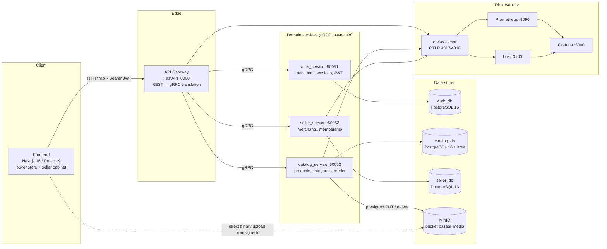

# Bazaar — Architecture

> How the services are laid out, how a request travels through the system, how identity is propagated across bounded contexts, and how failures are translated.
>
> Companion docs:
> [database.md](database.md) · [api.md](api.md) · [services.md](services.md) · [observability.md](observability.md)

---

## 1. System overview



Key properties:

- **The gateway is the single HTTP surface.** Nothing else is published to the host network by
  default; services are only reachable on the internal Docker `app-network` over gRPC.
- **Domain services never call each other.** There is no service-to-service RPC at runtime; the
  gateway orchestrates. Cross-context links are plain IDs (see §5).
- **Database-per-service.** Three independent PostgreSQL instances; no shared schema, no
  cross-database joins, no distributed transactions.
- **Binary traffic bypasses the backend** — media goes browser → MinIO directly via S3 presigned
  URLs (§7).

## 2. Communication model

| Hop                    | Protocol                          | Why                                                                        |
| ---------------------- | --------------------------------- | -------------------------------------------------------------------------- |
| Frontend → Gateway    | HTTP/JSON (REST,`/api/v1/*`)    | browser-friendly, public contract, Swagger at `/docs`                    |
| Gateway → services    | gRPC (`grpc.aio`), protobuf     | typed, versioned contracts in[`protos/`](../protos), efficient internal RPC |
| Services → PostgreSQL | SQL via SQLAlchemy 2 +`asyncpg` | one dedicated DB per service                                               |
| catalog → MinIO       | S3 API (`aioboto3`)             | object storage for product media                                           |

> **Not yet built:** event-driven messaging (Kafka). Today all coupling is synchronous gRPC
> orchestrated by the gateway. See [roadmap.md](roadmap.md).

### gRPC contracts (source of truth: `protos/`)

| Package        | Service        | Methods                                                                                                                                                                                                                                                                                                                                  |
| -------------- | -------------- | ---------------------------------------------------------------------------------------------------------------------------------------------------------------------------------------------------------------------------------------------------------------------------------------------------------------------------------------- |
| `auth.v1`    | AuthService    | `SignUp`, `Login`, `Logout`, `Refresh`, `ValidateToken`                                                                                                                                                                                                                                                                        |
| `catalog.v1` | CatalogService | Products:`CreateProduct`, `ReadProduct`, `ReadListProducts`, `UpdateProduct`, `DeleteProduct` · Media: `GetMediaUploadUrl`, `ConfirmMediaUpload`, `DeleteMedia`, `ReorderMedia` · Categories: `CreateCategory`, `ReadCategory`, `ReadListCategories`, `UpdateCategory`, `DeleteCategory`, `MoveCategory` |
| `seller.v1`  | SellerService  | `CreateMerchant`, `GetMerchant`, `ListUserMerchants`, `VerifyAccess`                                                                                                                                                                                                                                                             |

Generated stubs are committed per service under `src/generated/<pkg>/v1/` and regenerated with
`grpc_tools.protoc` — see [development.md](development.md#5-protocol-buffers--grpc).

## 3. Request flows

### 3.1 Authentication: signup / login → tokens

```
Browser            Gateway (FastAPI)       auth_service (gRPC)               auth_db
  │  POST /api/v1/auth/login                     │                               │
  ├────────────────▶│  LoginUseCase            │                               │
  │                 ├── gRPC Login ─────────────▶│  verify bcrypt hash          │
  │                 │                            ├────────────────────────────▶ │
  │                 │                            │◀── account row ──────────────┤
  │                 │                            │  create/reactivate session     │
  │                 │                            │  issue access(30m)+refresh(7d) │
  │                 │◀── tokens ───────── ──────┤  store sha256(refresh) in     │
  │◀── 200 {access_token, refresh_token} ───────┤  sessions.refresh_token_hash  │
```

Token design (implemented in `auth_service`, details in [services.md](services.md#auth-service)):

- **Access JWT** — 30 min, claims: `iss`, `iat`, `nbf`, `exp`, `jti`, `type=access`, `user_id`,
  `session_id`.
- **Refresh JWT** — 7 days, `type=refresh`. Only its **SHA-256 hash** is persisted.
- **Rotation + replay protection** — every `Refresh` replaces the stored hash; an old token is
  rejected. **Logout** deactivates the session and clears the hash, instantly invalidating tokens.
- Tokens are "stateful JWTs": even an unexpired access token fails `ValidateToken` if its session
  row is inactive.

### 3.2 Any authenticated request (Bearer)

```
Authorization: Bearer <access_token>
   │
   ▼
Gateway dependency get_current_user_id
   ├─ gRPC auth.ValidateToken  ──▶  auth_service: verify signature/issuer/type
   │                                 + session is_active in DB  ──▶  user_id (UUID)
   └─ invalid/missing ──▶ 401
```

### 3.3 Seller request (two-hop context: who + which shop)

Every `/api/v1/seller/*` route uses `get_current_merchant_context`:

```
headers: Authorization: Bearer … · X-Merchant-ID: <id>
   │
   ▼
1. ValidateToken (auth_service)                 → user_id        ── 401 on failure
2. VerifyAccess(user_id, merchant_id) (seller_service)
       → active membership in merchant_members?  → {allowed, role}
                                                 ── 403 if not, 422 if header missing
3. downstream use cases receive MerchantContext(user_id, merchant_id, role)
   e.g. product ownership is checked against merchant_id inside catalog_service
```

This is the composition-of-services pattern: the gateway orchestrates auth + seller to secure a
catalog operation — without the three services ever knowing about each other.

### 3.4 Read path examples

- Buyer catalog browse: `GET /api/v1/catalog/category` (flat list; the frontend rebuilds the tree
  from `parent_id`) and `GET /api/v1/catalog/product?limit&offset`.
- Seller stock table: `GET /api/v1/seller/products` (filtered by merchant).

## 4. Internal structure of a service

All backend packages share one template (Clean Architecture / ports & adapters):

```
presentation   gRPC handlers + interceptors (gateway: FastAPI routers, dependencies)
      │ depends on application    use cases — orchestration only, one callable class per operation
      │ depends on domain entities · DTOs · exceptions · interfaces (AbstractUnitOfWork,
      ▲            repositories, storage) — ZERO framework imports implements
      │ 
infrastructure SQLAlchemy models + repositories + UoW · S3 client · settings
         (pydantic-settings) · DI (dishka) · logging · telemetry
```

Conventions:

- **Repository + Unit of Work**: use cases open `async with uow:` — transaction boundary, commit at
  the end; repositories never leak SQLAlchemy types into `domain`.
- **Dependency injection with `dishka`**: gRPC services get scoped factories via
  `DishkaAioInterceptor`; the gateway uses `FastapiProvider` + `@inject` + `FromDishka[T]`.
  **Tests override ports** (fake UoW, mocked gateways) rather than patching internals.
- **Cross-cutting concerns are interceptors**: structured logging of every RPC (method, duration,
  code) in each gRPC service.

## 5. Identity & cross-service references (no FK across DBs)

| Reference                                       | Type          | Where stored                                                                                                              | Enforcement                                                                                              |
| ----------------------------------------------- | ------------- | ------------------------------------------------------------------------------------------------------------------------- | -------------------------------------------------------------------------------------------------------- |
| `user_id`                                     | UUID (string) | `auth.accounts.id` → referenced by `seller.merchants.owner_user_id`, `seller.merchant_members.user_id`, JWT claims | gateway resolves the token before calling seller; seller trusts the gateway's `user_id`                |
| `merchant_id`                                 | BIGINT        | `seller.merchants.id` → `catalog.products.merchant_id`                                                               | gateway `VerifyAccess` (membership) + catalog use cases (product must be owned by the acting merchant) |
| `category_id` / `product_id` / `media id` | BIGINT        | within `catalog_db` only                                                                                                | real SQL FKs (`RESTRICT` / `CASCADE`)                                                                |

Design rules:

1. **Within** a service: full referential integrity (FKs, CHECKs, unique indexes) — see
   [database.md](database.md).
2. **Across** services: identity + ownership checks at the composition point (gateway), never
   cross-database joins, never distributed transactions. Orphan references are the documented,
   accepted trade-off of this decoupling.

## 6. Error model: gRPC → HTTP

gRPC handlers signal failures via status codes; the gateway translates them to typed domain
exceptions (`src/infrastructure/grpc/errors.py` + `src/domain/exceptions.py`) rendered as a JSON
body `{"detail": ...}` by a registered exception handler.

| gRPC status                             | Gateway exception            | HTTP | Typical cause                                   |
| --------------------------------------- | ---------------------------- | ---- | ----------------------------------------------- |
| `INVALID_ARGUMENT`                    | `ValidationError`          | 422  | failed domain validation (email/phone/price…)  |
| `NOT_FOUND`                           | `NotFoundError`            | 404  | missing product/category/merchant/session       |
| `ALREADY_EXISTS`                      | `ConflictError`            | 409  | duplicate email / INN / media limit             |
| `PERMISSION_DENIED`                   | `PermissionDeniedError`    | 403  | merchant doesn't own the product; no membership |
| `UNAUTHENTICATED`                     | `UnauthenticatedError`     | 401  | bad/expired token, inactive session             |
| `UNAVAILABLE` / `DEADLINE_EXCEEDED` | `UnavailableError`         | 503  | upstream service down/slow                      |
| any other                               | `ApplicationError`         | 500  | unexpected                                      |
| *(gateway-local)*                     | `MediaUploadConflictError` | 400  | media quota/format rejected before upload       |

Pydantic request-schema failures are handled by FastAPI itself (422), and missing
`X-Merchant-ID` is 422 raised directly in the dependency.

## 7. Media pipeline (presigned uploads)

Ownership: media is entirely inside the **catalog** context (metadata in `catalog_db`,
S3 operations via `aioboto3`). Bucket `bazaar-media` is created and made anonymously
read-download by the `minio-init` job on first compose up.

```
seller cabinet (browser)                Gateway                catalog_service                MinIO
  │ ① POST …/media/upload-url              │                        │                           │
  │    {media_type, content_type,          │── GetMediaUploadUrl ──▶│ ownership + rules       │
  │     file_size, width, height, duration}│                        │  (mime/size/3:4 ≤10MB /   │
  │◀── {upload_url, storage_key, public_url}│◀── presigned PUT ≤600s│   video ≤50MB ≤180s,   │
  │                                        │                        │   unique video)           │
  │ ② PUT <upload_url>  <binary> ──────────┼────────────────────────┼────────────────────────▶ │
  │    (direct to MinIO, bypasses backend) │                        │                           │
  │ ③ POST …/media/confirm {storage_key,…} │                        │                           │
  │                                        │── ConfirmMediaUpload ──▶│ INSERT product_media row│
```

Rules are validated **client-side first** (`frontend/src/modules/sellers/utils/media-validation.ts`)
and **again server-side** in the use cases; ordering is a `position` column (0 = cover). The
"max one video per product" invariant is additionally enforced at the DB level with a partial
unique index. Details: [database.md](database.md#5-object-storage-minio--s3) · [api.md](api.md#6-seller-catalog--products--media-bearer--x-merchant-id).

## 8. Ports map

| Component                   | Host                | Port               | Published to host?     |
| --------------------------- | ------------------- | ------------------ | ---------------------- |
| Frontend                    | `frontend`        | 3001 → 3000       | ✅                     |
| API Gateway                 | `api_gateway`     | 8000               | ✅                     |
| auth gRPC                   | `auth_service`    | 50051              | ❌ internal            |
| catalog gRPC                | `catalog_service` | 50052              | ❌ internal            |
| seller gRPC                 | `seller_service`  | 50053              | ❌ internal            |
| auth_db / catalog_db        | containers          | 5432 internal      | ❌                     |
| seller_db                   | container           | 5434 → 5432       | ✅ (debug convenience) |
| MinIO S3 / console          | `minio`           | 9000 / 9001        | ✅                     |
| OTLP gRPC / HTTP            | `otel-collector`  | 4317 / 4318        | ✅                     |
| Collector metrics           | `otel-collector`  | 8889               | ✅                     |
| Prometheus / Loki / Grafana | —                  | 9090 / 3100 / 3000 | ✅                     |

## 9. Frontend architecture (coarse)

Next.js 16 App Router, feature-modules layout inside one repo:

```
src/app/(client)   buyer pages: /, /catalog, /catalog/[...categoryPath] (mirrors ltree path),
                   /product/[slug] (slug = `title-id`), /cart
src/app/(auth)     /login, /register
src/app/(seller)   seller cabinet: /seller/onboarding, /seller/dashboard, /seller/inventory
                   (merchant switcher, product CRUD, media uploader/gallery)
src/modules/*      feature slices (api services, stores, components)
src/shared/*       axios client (Bearer + 401 cleanup interceptor), UI kit (shadcn/ui),
                   theme, query-client
```

State: **TanStack Query** for server data; **Zustand (persist)** for auth session, cart
(localStorage — no server cart yet), active merchant selection. SEO: metadata API, `sitemap.ts`,
`robots.ts`, JSON-LD product data.

## 10. Decisions & trade-offs summary

| Decision                             | Rationale / trade-off                                                                                                                     |
| ------------------------------------ | ----------------------------------------------------------------------------------------------------------------------------------------- |
| Sync gRPC now, Kafka later           | simpler consistency model while the domain is still moving; events planned where fan-out is real (order lifecycle, notifications)         |
| Gateway-composed auth                | services stay free of cross-domain knowledge; the gateway pays for the orchestration (2–3 RPCs per seller call)                          |
| Stateful JWT (session row)           | instant revocation/logout at the cost of a DB check per validated call; Redis cache is a roadmap item                                     |
| Database-per-service + ID refs       | deployability and schema isolation; no cross-service integrity — accepted, enforced at composition                                       |
| `ltree` + `parent_id` dual model | `parent_id` guarantees structure, `path` buys O(1)-ish subtree reads; the write path must maintain both (done inside one transaction) |
| Presigned uploads                    | keeps gateway stateless and lean; requires re-validating metadata on confirm (done)                                                       |
