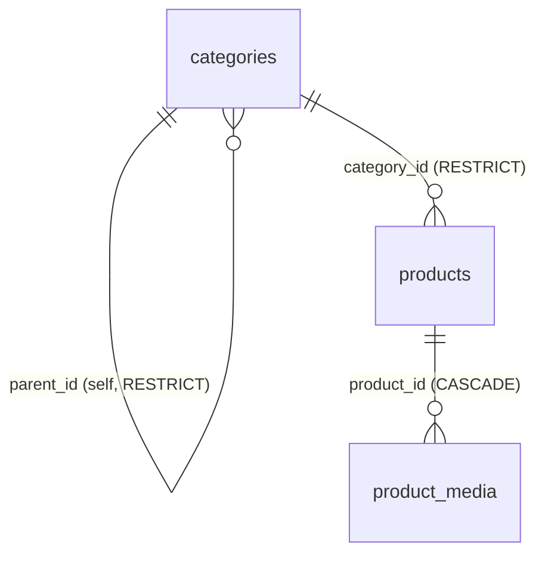
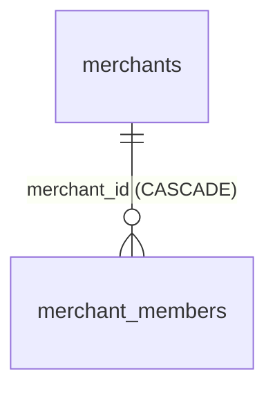

# Bazaar — Databases

> Storage model of the platform: one PostgreSQL instance per service, what lives in each schema,
> how the `ltree` category hierarchy works, where product media actually goes, and how Alembic is
> operated. Related: [architecture.md](architecture.md) · [services.md](services.md)

---

## 1. Principles

1. **Database-per-service.** `auth`, `catalog` and `seller` each own a dedicated PostgreSQL 16
   instance (`auth_db`, `catalog_db`, `seller_db` containers). No shared schemas, no cross-service
   joins, no distributed transactions.
2. **Integrity lives where the data lives.** Within one database the model uses real FKs, CHECKs,
   partial unique indexes. **Across** databases the same relations are plain IDs verified in code —
   see [architecture.md §5](architecture.md#5-identity--cross-service-references-no-fk-across-dbs).
3. **Access pattern.** SQLAlchemy 2.x (typed `Mapped[]`) over `asyncpg`; repositories implement the
   interfaces declared in each service's `domain` layer; all writes go through a Unit of Work.
4. **Schema evolution.** Alembic per service, its own `alembic.ini` + `migrations/` folder. In
   Docker, one-shot `*_migrations` jobs run `alembic upgrade head` and services wait for them
   (`service_completed_successfully`).
5. **ID types.** UUID (v4) for auth identities; PostgreSQL `BIGINT` (autoincrement) for catalog /
   seller aggregates. Cross-service references therefore carry user IDs as **strings** (36 chars) in
   seller tables.

Connection string shape (`Settings`, pydantic-settings):

```
postgresql+asyncpg://${POSTGRES_USER}:${POSTGRES_PASSWORD}@${POSTGRES_HOST}:${POSTGRES_PORT}/${POSTGRES_DB}
```

Only `seller_db` publishes a host port (5434→5432) for debugging; inspect other DBs via
`docker exec -it catalog_db psql -U bazaar` (or the auth equivalent).

## 2. auth_db — accounts & sessions


### `accounts`

| Column | Type | Notes |
|---|---|---|
| `id` | UUID PK | default `uuid4`; this is the platform-wide **user_id** |
| `email` | text | **unique**; validated format in the domain layer |
| `phone` | text NULL | pattern `+7999…` on signup |
| `password_hash` | text | **bcrypt, cost 12** |
| `is_active` | bool | default true |
| `last_login_at` | timestamp NULL | bumped on login |
| `created_at` / `updated_at` | timestamp | app-level defaults |

### `sessions`

| Column | Type | Notes |
|---|---|---|
| `id` | UUID PK | equals JWT `session_id` claim |
| `user_id` | UUID FK → `accounts.id` | not null |
| `is_active` | bool | logout flips it to false → instantly kills token validation |
| `refresh_token_hash` | text NULL | **SHA-256 of the issued refresh JWT** — rotated on every refresh; replay rejected when mismatch |
| `last_active_at` | timestamp | session heartbeat |

Migrations: `create_account_and_session_tables` → `add_refresh_token_hash_to_sessions`.

## 3. catalog_db — products, categories, media



### `categories` — hierarchy on `ltree`

| Column | Type | Notes |
|---|---|---|
| `id` | BIGINT PK | |
| `name` | text | |
| `parent_id` | BIGINT NULL, FK → `categories.id` `ON DELETE RESTRICT` | **source of structural truth** |
| `path` | `ltree` NOT NULL | **denormalized materialized path** (`electronics.audio.headphones`), GiST index `ix_categories_path` |
| `is_active` | bool | |
| `created_at` / `updated_at` | timestamp | |

**Why two representations?** `parent_id` guarantees referential structure (self-FK, delete
protection); `path` buys set-based reads: the repository's `descendant_of()` (`path <@ 'a.b'`)
selects an entire subtree with one GiST-accelerated predicate — used by `MoveCategory` to rewrite
all descendants, and by the frontend which mirrors ltree paths in URLs
(`/catalog/electronics/audio`).

The `add_parent_id_to_categories` migration backfilled `parent_id` from existing paths
(`split_part(ltree2text(path), '.', nlevel(path) - 1)`), keeping the two in sync going forward
within one UoW transaction on every create/update/move.

### `products`

| Column | Type | Notes |
|---|---|---|
| `id` | BIGINT PK | |
| `merchant_id` | BIGINT NOT NULL, indexed | cross-service reference → `seller.merchants.id`, **no FK**; ownership checked in use cases |
| `category_id` | BIGINT NOT NULL, FK → `categories.id` `RESTRICT`, indexed | a product must have a category |
| `title` | text NOT NULL | frontend slug = `title-id` |
| `description` | text NULL | |
| `price` | integer | CHECK `ck_products_price_non_negative` (`>= 0`) |
| `stock` | integer default 0 | CHECK `ck_products_stock_non_negative` (`>= 0`) |
| `is_active` | bool | |
| `created_at` / `updated_at` | timestamp | |

### `product_media`

| Column | Type | Notes |
|---|---|---|
| `id` | BIGINT PK | |
| `product_id` | BIGINT FK → `products.id` `CASCADE`, indexed | |
| `media_type` | enum(`IMAGE`,`VIDEO`) | |
| `storage_key` | varchar(512) | object key in MinIO |
| `url` | varchar(1024) | public read URL |
| `position` | integer default 0 | gallery order; 0 = cover; index `(product_id, position)` |
| `width` / `height` | integer NULL | images: 3:4 ratio (±0.02), ≥ 900×1200 |
| `duration_seconds` | integer NULL | videos: ≤ 180 |
| `file_size` | bigint | images ≤ 10 MB, videos ≤ 50 MB |
| `created_at` | timestamptz | server default `now()` |

**`uq_product_single_video`** — partial unique index on `product_id WHERE media_type = 'VIDEO'`:
"at most one video per product" is enforced by PostgreSQL itself, not just the use case.

Migrations: create tables (+`ltree` extension) → add `parent_id` + backfill → add `merchant_id` →
add `product_media`.

## 4. seller_db — merchants & membership



### `merchants`

| Column | Type | Notes |
|---|---|---|
| `id` | BIGINT PK | referenced as `merchant_id` by catalog (no FK) |
| `name` | varchar(255) | |
| `inn` | varchar(12) | tax id; **unique index** `ix_merchants_inn_unique` — one shop per INN |
| `owner_user_id` | varchar(36) | auth UUID as string; indexed |
| `status` | varchar(32) | `ACTIVE` / `PENDING_VERIFICATION` (enum lives in `seller.v1` proto) |
| `created_at` | timestamp | |

### `merchant_members`

| Column | Type | Notes |
|---|---|---|
| `id` | BIGINT PK | |
| `merchant_id` | BIGINT FK → `merchants.id` `CASCADE` | |
| `user_id` | varchar(36) | auth UUID as string (cross-context, no FK) |
| `role` | varchar(16) default `VIEWER` | `OWNER` / `MANAGER` / `VIEWER` |
| `is_active` | bool | inactive member ⇒ `VerifyAccess` denies |

Unique constraint `(merchant_id, user_id)`; indexes on `merchant_id` and `user_id`. Creating a
merchant atomically inserts the creator's `OWNER` membership row (same UoW transaction).

Migration: `create_merchant_and_merchant_member_tables`.

## 5. Object storage (MinIO / S3)

| Aspect | Value |
|---|---|
| Engine | MinIO in compose (prod-compatible S3 API) |
| Bucket | `bazaar-media` — auto-created and set `anonymous set download` by the `minio-init` job |
| Client | `aioboto3`, only inside `catalog_service` (`infrastructure/storage/s3.py`) |
| Upload | **presigned PUT**, default expiry **600 s**, issued by `GetMediaUploadUrl` |
| Read | browsers hit `S3_PUBLIC_URL/bazaar-media/<key>` directly |
| Delete | `DeleteMedia` removes the DB row **and** calls `delete_object` |

## 6. Alembic workflow (identical per service)

```bash
cd services/<name>                       # each service has alembic.ini + migrations/
uv run alembic current                   # what's applied
uv run alembic revision --autogenerate -m "Add orders table"
uv run alembic upgrade head              # apply
uv run alembic downgrade -1              # step back (dev)
```

Notes learned from this repo's migrations:

- Postgres-specific ops go through `op.execute()` (`CREATE EXTENSION IF NOT EXISTS ltree`).
- Autogenerate misses enum/index subtleties — always read the generated file.
- `migrations/env.py` builds the async engine from the same `Settings` as the app.
- Migrations are **per-service deploy units**: compose runs each `*_migrations` job before its
  service container.
- Minor known wart: `downgrade()` of the first catalog migration drops CHECK constraints *after*
  dropping their table — downgrade-only failure, tracked in [roadmap.md](roadmap.md).

## 7. Quick psql tour

```bash
docker exec -it seller_db psql -U bazaar          # host port 5434: psql -h localhost -p 5434

-- categories subtree (the ltree trick used by MoveCategory):
SELECT id, name, path FROM categories WHERE path <@ 'electronics.audio';

-- who may act on a merchant:
SELECT m.name, mm.user_id, mm.role
FROM merchants m JOIN merchant_members mm ON mm.merchant_id = m.id
WHERE mm.is_active AND m.inn = '7700000000';
```
