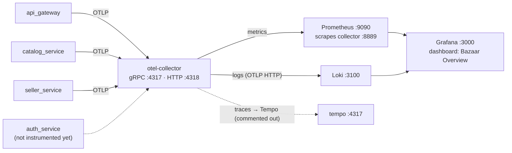

# Bazaar — Observability

> The telemetry stack shipped with the project: what is collected, how it flows, where to look.
> Configs live in [`infrastructure/observability/`](../infrastructure/observability); the containers are defined in [`infrastructure/docker/compose/docker-compose.yml`](../infrastructure/docker/compose/docker-compose.yml).

---

## 1. Pipeline



Collector details (`otel-collector-config.yaml`):

| Stage      | Components                                                                                                                                                                                                                                |
| ---------- | ----------------------------------------------------------------------------------------------------------------------------------------------------------------------------------------------------------------------------------------- |
| Receivers  | OTLP over gRPC `:4317` and HTTP `:4318`                                                                                                                                                                                               |
| Processors | `memory_limiter` (80 % / 25 % spike) → `resourcedetection` (env, system) → `resource` (`deployment.environment.name` from `OTEL_DEPLOYMENT_ENVIRONMENT`, default `local`) → `batch` (1024 / 5 s)                         |
| Exporters  | `prometheus` on `:8889` with resource→telemetry conversion; `otlphttp/loki` → `http://loki:3100/otlp`; `debug` sampler; **`otlp/tempo` + traces pipeline commented out** — traces are dropped until Tempo is enabled |
| Health     | `:13133` (healthcheck)                                                                                                                                                                                                                  |

## 2. What each service emits

| Service             | Instrumentation                                       | Notes                                                          |
| ------------------- | ----------------------------------------------------- | -------------------------------------------------------------- |
| `api_gateway`     | `FastAPIInstrumentor` (excludes `metrics            | health                                                         |
| `catalog_service` | `setup_telemetry()` + `GrpcAioInstrumentorClient` |                                                                |
| `seller_service`  | same as catalog                                       |                                                                |
| `auth_service`    | **none** — no OTel wiring yet ⚠️             | logs only (stdout, structlog); tracked in[roadmap.md](roadmap.md) |

**Logs everywhere** are structured JSON via `structlog` (level, event name like `grpc.server_started`,
merchant/user context). The gateway additionally runs `LoggingMiddleware`:

- generates/propagates `request_id` (+ `trace_id`/`span_id` when OTel is active),
- logs method/path/status/duration,
- echoes `X-Request-ID` in the response — quote it when debugging in Loki.

## 3. Storage & UI components

| Component                            | Version | Host port      | Config                                                                                               | Notes                                                                                                                                            |
| ------------------------------------ | ------- | -------------- | ---------------------------------------------------------------------------------------------------- | ------------------------------------------------------------------------------------------------------------------------------------------------ |
| Prometheus                           | v3.13   | 9090           | [`prometheus/prometheus.yml`](../infrastructure/observability/prometheus/prometheus.yml) + `rules/` | retention `${PROM_RETENTION:-15d}`, `--web.enable-lifecycle` for hot reload                                                                  |
| Loki                                 | 3.7     | 3100           | [`loki/loki-config.yaml`](../infrastructure/observability/loki/loki-config.yaml)                      | filesystem store (`loki-data` volume), OTLP ingest                                                                                             |
| Grafana                              | 13.1    | **3000** | [`grafana/provisioning/…`](../infrastructure/observability/grafana/provisioning)                     | datasources (Prometheus+Loki) auto-provisioned; dashboards synced from[`grafana/dashboards/`](../infrastructure/observability/grafana/dashboards) |
| MinIO (not telemetry, but same file) | —      | 9000/9001      | —                                                                                                   | `minio-init` creates `bazaar-media`, public read                                                                                             |

## 4. The «Bazaar Overview» dashboard

`infrastructure/observability/grafana/dashboards/bazaar-overview.json`, panels:

- **RPS** and **5xx error rate** (Prometheus: `http_server_duration_count`-style OTLP metrics)
- **P95 latency**, request size
- **Application logs / error counts** from Loki
- A **`service` template variable** to filter by `api_gateway` / `catalog_service` / `seller_service`

LogQL example (errors of the gateway with a concrete request):

```
{service_name="api_gateway"} |= "http.request_failed" | json | request_id = "..."
```

## 5. Enabling distributed tracing (when ready)

Everything is already in place except two commented blocks:

1. in `otel-collector-config.yaml` — uncomment the `otlp/tempo` exporter and the `traces` pipeline;
2. in `infrastructure/docker/compose/docker-compose.yml` — uncomment the `tempo` service and the
   collector's `depends_on: tempo`.

Then `trace_id`s already exported in gateway logs become jump-off points into Tempo flame graphs.
`auth_service` should be instrumented first — otherwise its spans are missing from traces
([roadmap.md](roadmap.md)).

## 6. Gaps

| Gap                                                | Impact                                                           | Fix                                                               |
| -------------------------------------------------- | ---------------------------------------------------------------- | ----------------------------------------------------------------- |
| `auth_service` not on OTel                       | no metrics/logs pipeline coverage for auth; blind spot in traces | mirror `infrastructure/observability/telemetry.py` from catalog |
| Tempo pipeline disabled                            | no cross-service trace correlation                               | §5 above                                                         |
| `bazaar-overview copy.json` in dashboards dir    | duplicate panel noise in Grafana                                 | delete the stray file                                             |
| No alerting                                        | Prometheus `rules/` mounted but Alertmanager commented out     | enable when SLOs matter                                           |
| Grafana port `3000` overlaps frontend dev server | localhost clash when frontend runs outside Docker                | set `GRAFANA_PORT` in `.env`                                  |
